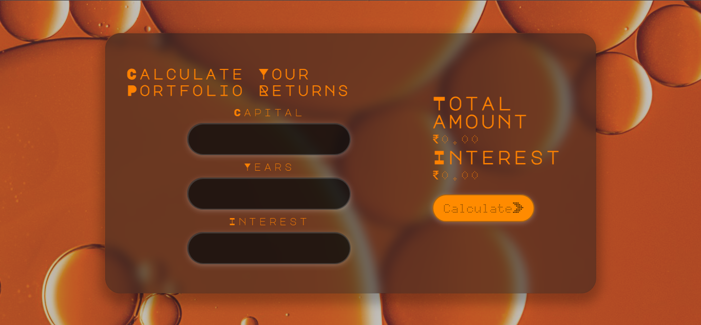
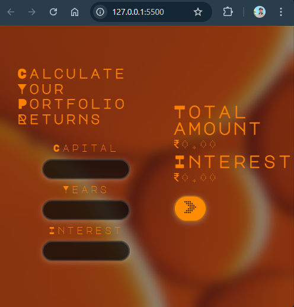

Here's a professional and informative `README.md` file for your **Portfolio Returns Calculator** project:

---

# 📈 Portfolio Returns Calculator

A sleek, modern, and responsive **web-based compound interest calculator** that helps users compute total returns and interest earned on their portfolio investments.


                           																	$$	   $$

---

## 🚀 Features

* 🔢 Calculates **compound interest** using:

  $$
  A = P \cdot (1 + \frac{r}{100})^t
  $$

  Where:

  * `P` = Principal (Capital)
  * `r` = Interest Rate
  * `t` = Time (Years)
* 🧊 Stylish **glassmorphism UI** with responsive layout
* 🎨 Custom fonts and smooth transitions
* ✅ Handles input validation and guides users with helpful alerts
* 💡 Autofill styles customized for Chrome users

---

## 🖥️ Live Preview

<!-- Add GitHub Pages or Netlify/Vercel link here if deployed -->

[Click here to try the calculator](#)

---

## 📂 Project Structure

```bash
├── index.html       # Main HTML structure
├── styles.css       # All styles including responsive design
├── scripts.js       # JavaScript logic for calculation
├── sharon-pittaway-4_hFxTsmaO4-unsplash.jpg # Background image
└── dot-arrow (1).png # Button icon
```

---

## 📸 Screenshot

> *Add a screenshot here if available to show off your UI*

---

## 🛠️ How to Use

1. Clone or download this repository.
2. Open `index.html` in your browser.
3. Enter:

   * Capital amount
   * Time in years
   * Annual interest rate
4. Click **"Calculate"** to view:

   * 📊 Total portfolio value
   * 💰 Interest earned

---

## 📱 Responsive Design

* Optimized for mobile, tablet, and desktop screens.
* Adjusts font size, layout, and spacing on smaller devices.

---

## 🧠 Tech Stack

* **HTML5** – Semantic layout
* **CSS3** – Responsive design, glassmorphism, transitions
* **JavaScript (Vanilla)** – DOM interaction & validation
* **Google Fonts** – `Major Mono Display`, `Doto`

---

## ❗ Known Issues

* Autofill styling may vary slightly across browsers.
* No persistent data storage — it's a frontend-only calculator.

---

## 📌 Future Enhancements

* Add EMI or SIP calculation modes.
* Export results as PDF.
* Dark/light theme toggle.

---

## 📃 License

This project is open-source and free to use under the [MIT License](LICENSE).
